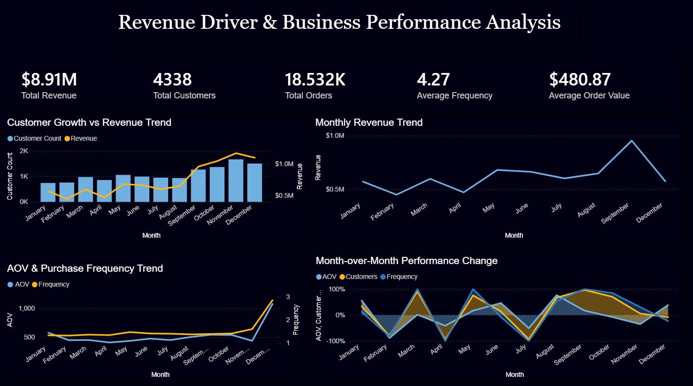
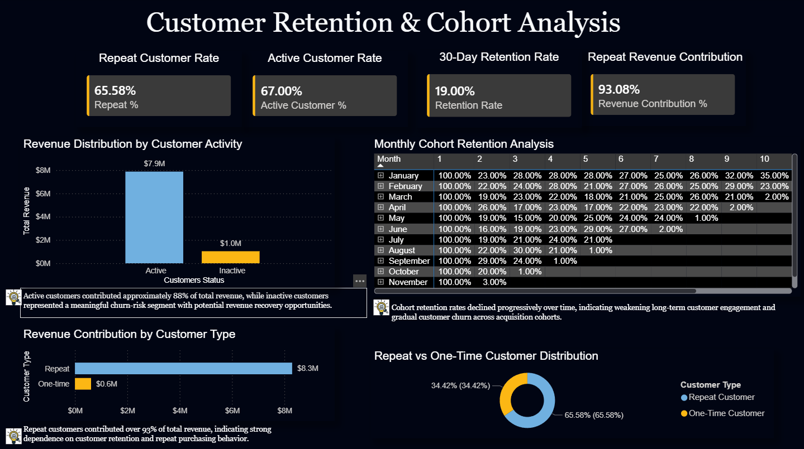
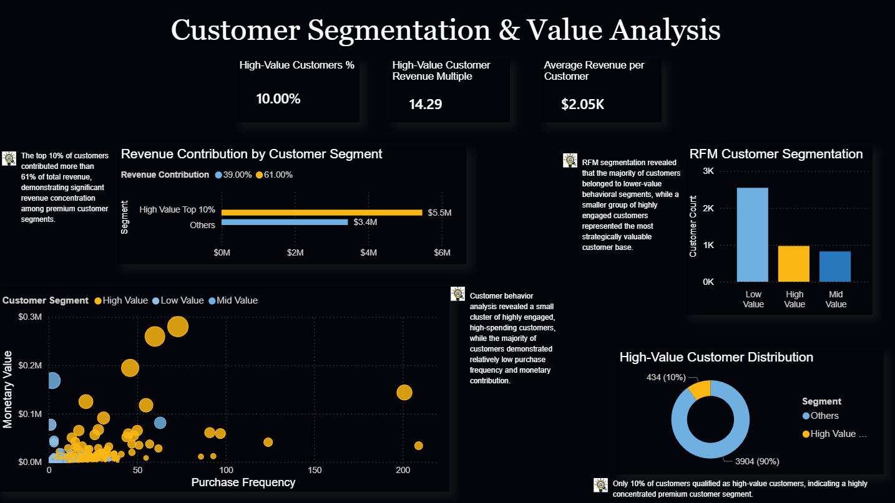

# Online Retail Customer Analytics & Revenue Decomposition

## Project Overview

This project analyzes customer purchasing behavior, retention patterns, and revenue drivers using SQL and Power BI.

The objective was to identify:

* key revenue growth drivers
* customer retention decay patterns
* repeat purchase behavior
* high-value customer concentration
* customer segmentation opportunities
* revenue contribution across customer segments

The project combines business-focused SQL analysis with executive-style dashboard storytelling to evaluate customer lifetime value, retention quality, and growth opportunities.

---

# Tools & Technologies

* SQL (MySQL)
* Power BI
* Excel

---

# Business Problems Solved

## Revenue Driver Analysis

* What factors are driving revenue growth?
* Is revenue growth driven by customer acquisition, purchase frequency, or basket size?
* How do monthly performance trends fluctuate over time?

## Customer Retention Analysis

* How effectively are customers retained after their first purchase?
* How quickly do cohorts experience retention decay?
* What percentage of revenue comes from repeat customers?

## Customer Segmentation Analysis

* Which customer segments contribute most revenue?
* How concentrated is revenue among high-value customers?
* How do customer behaviors differ across RFM segments?

## Customer Activity Analysis

* What percentage of customers are inactive?
* How much revenue is exposed to churn risk?
* Which customers should be prioritized for retention strategies?

---

# Key Analyses Performed

### Revenue Decomposition

Decomposed Revenue into:

```text
Revenue = Customers × Purchase Frequency × Average Order Value
```

to identify the primary drivers behind monthly revenue fluctuations.

---

### Cohort Retention Analysis

Performed cohort-based retention analysis to evaluate:

* long-term customer engagement
* repeat purchasing behavior
* retention decay across acquisition cohorts

---

### Repeat vs One-Time Customer Analysis

Compared:

* repeat customer contribution
* one-time customer contribution
* revenue dependency on loyal customers

---

### High-Value Customer Analysis

Used decile segmentation to identify:

* top 10% revenue-generating customers
* revenue concentration patterns
* premium customer dependency

---

### RFM Customer Segmentation

Segmented customers based on:

* Recency
* Frequency
* Monetary Value

to classify:

* High-Value Customers
* Mid-Value Customers
* Low-Value Customers

---

### Active vs Inactive Customer Analysis

Identified:

* active customer base
* inactive customer risk
* revenue exposure from disengaged customers

---

# Key Insights

* Repeat customers contributed over **93%** of total revenue, demonstrating strong dependence on customer retention.
* The top **10% of customers generated more than 61% of total revenue**, indicating significant revenue concentration among premium customers.
* Cohort retention rates declined progressively over time, highlighting weakening long-term customer engagement.
* Active customers contributed approximately **88% of total revenue**, while inactive customers represented meaningful churn-risk opportunities.
* Revenue growth during peak months was primarily driven by customer acquisition and improved purchase frequency.

---

# Dashboard Pages

---

# Page 1 — Revenue Driver & Business Performance Analysis

### Focus Areas

* Revenue trends
* Customer growth
* Purchase frequency
* Average order value
* Revenue decomposition
* Month-over-month performance analysis

### Dashboard Preview



---

# Page 2 — Customer Retention & Cohort Analysis

### Focus Areas

* Cohort retention analysis
* Repeat customer contribution
* Customer activity monitoring
* Retention KPIs
* Churn-risk evaluation

### Dashboard Preview


---

# Page 3 — Customer Segmentation & Value Analysis

### Focus Areas

* High-value customer analysis
* Revenue concentration
* RFM segmentation
* Behavioral customer analysis
* Customer value distribution

### Dashboard Preview



---

# Repository Structure

```text
dashboard_screenshots/
│
├── dashboard1.png
├── dashboard2.png
└── dashboard3.png

sql_queries/
│
├── 01_data_overview.sql
├── 02_data_cleaning.sql
├── 03_basic_kpis.sql
├── 04_cohort_retention_analysis.sql
├── 05_repeat_vs_onetime_customers.sql
├── 06_high_value_customer_analysis.sql
├── 07_active_vs_inactive_customers.sql
├── 08_rfm_customer_segmentation.sql
├── 09_revenue_decomposition_analysis.sql
└── 10_pareto_analysis.sql

dashboard.pbix

README.md
```

---

# Business Recommendations

### Improve Customer Retention

Implement retention-focused campaigns targeting early repeat purchases to reduce cohort retention decay.

---

### Protect High-Value Customers

Develop VIP-focused loyalty strategies for premium customer segments responsible for the majority of revenue.

---

### Re-Engage Inactive Customers

Launch reactivation campaigns for inactive customers to recover lost revenue opportunities.

---

### Increase Purchase Frequency

Use personalized promotions and lifecycle marketing to encourage repeat purchasing behavior.

---

# Project Outcome

This project demonstrates:

* advanced SQL analytics
* customer retention analysis
* business KPI decomposition
* customer segmentation strategy
* executive dashboard storytelling
* data-driven business decision support


# Online Retail Customer Analytics & Revenue Decomposition

### Author
**MD Faizan Ali**

🔗 LinkedIn: www.linkedin.com/in/md-faizan-ali-31032001business
🔗 GitHub: https://github.com/faizanali00786
